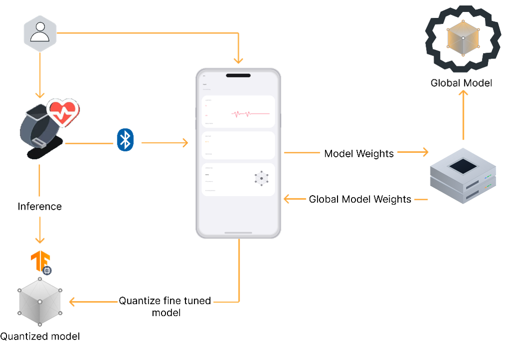
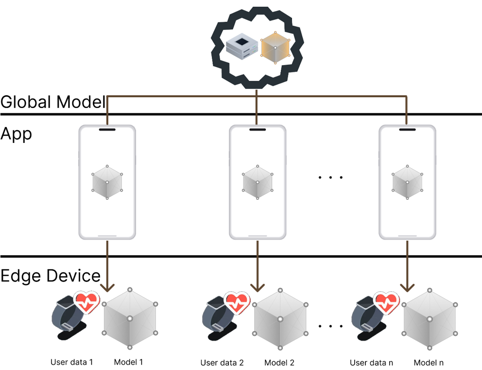
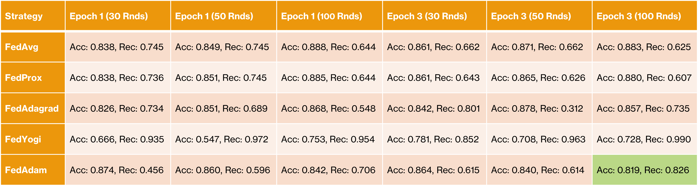

# Sakina FL Server

This repository contains the central Federated Learning (FL) server for the Sakina stress monitoring system. It serves as the decentralized "brain" of the project, managing global model updates while ensuring user privacy.

## Project Overview
Sakina is a real-time stress monitoring system that utilizes Federated Learning to train AI models without ever seeing raw user data. The server manages the global model lifecycle, benchmarks various aggregation strategies, and provides a communication bridge for mobile clients.

---

## System Architecture & Workflow

The server interacts with two main layers to facilitate decentralized learning:

1.  **The Edge Layer (ESP32):** Performs local inference using a quantized TFLite model.
2.  **The Mobile Layer (Flutter):** Acts as the intermediary, performing local fine-tuning on-device and communicating with this server via REST API.

### High-Level FL Pipeline
* **Model Pull:** Clients download the current global weights from the server using the GET /api/global_model endpoint.
* **Local Training:** Clients fine-tune the model on their own physiological data (BVP and Temperature).
* **Weight Push:** Clients send updated weights back to this server via the POST /api/local_update endpoint.
* **Aggregation:** The server merges updates into a new, smarter global model.

---

## Repository Components

### 1. server.py (Research & Benchmarking)
Used for evaluating FL aggregation strategies using simulated Python clients.
* **Interactive selection:** Supports FEDAVG, FEDPROX, FEDADAGRAD, FEDYOGI, and FEDADAM.
* **Loss Function:** Implements a custom Focal Loss to handle class imbalances in stress data.
* **Performance Tracking:** Logs Accuracy and Recall results to fl_results.txt to help identify the most reliable strategy.

### 2. server_app_connection.py (Live Mobile Bridge)
The production-ready bridge allowing physical mobile devices to join the FL network.
* **Dual-Protocol:** Runs Flower gRPC (port 8080) for simulations and Flask REST API (port 5050) for Flutter app connections.
* **Weight Translation:** Automatically handles transposing model weights between Dart (Flutter) and Keras (Python) formats.
* **SakinaStrategy:** A custom class that merges real-time mobile updates into the global model rounds.

### 3. client.py (Simulation Client)
Helper script to simulate independent users during the research phase.
* **Data Processing:** Uses the WESAD dataset to treat 17 subjects as independent clients (S2–S17).
* **Feature Extraction:** Generates 5 key features (BVP Mean/Std, TEMP Mean/Std/Slope) from 60-second windows.

---

## Benchmarking & Strategy Selection

We evaluated multiple strategies to find a balance between Accuracy and Recall to avoid "fake accuracy".

| Strategy | Epoch 3 (100 Rnds) | Result |
| :--- | :--- | :--- |
| **FedAvg** | Acc: 0.883, Rec: 0.625 | High accuracy, but significant recall drop. |
| **FedYogi** | Acc: 0.728, Rec: 0.990 | High recall, but unacceptable accuracy. |
| **FedAdam** | **Acc: 0.819, Rec: 0.826** | **Optimal Balance (Selected Strategy)**. |

---

## Getting Started

### 1. Prerequisites
* Place your pre-trained base model (MLP_big_epoch.h5) in the root directory.
* Install dependencies: pip install flwr tensorflow flask numpy scikit-learn

### 2. Run Simulation Benchmarking
python server.py

### 3. Run Mobile Integration Server
python server_app_connection.py

* REST API (Port 5050): Used by the Flutter app to pull/push weights via HTTP.
* gRPC (Port 8080): Used by Python simulation clients.
* Endpoints:
    * GET /api/global_model: Download the latest global weights.
    * POST /api/local_update: Upload locally trained weights from the mobile app.

---
**Sakina Project** | *Privacy-Preserving Stress Monitoring using Federated Learning*